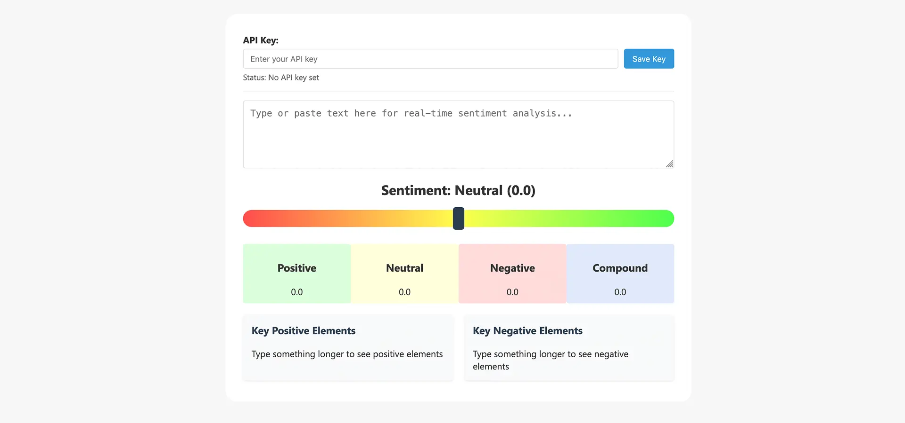
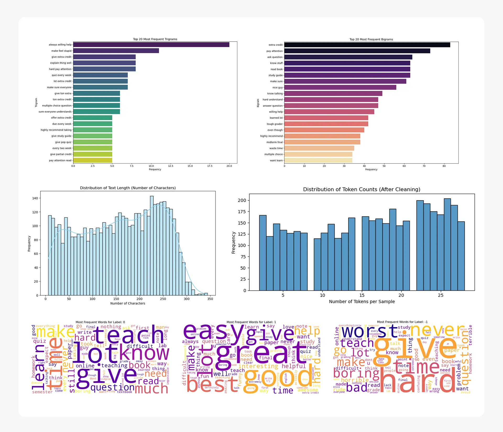

## Part 1: Business-Focused Project Overview

<em style="display: block; text-align: center;">Above is the business brief presentation of this project</em>

## 1. Background and Overview

Queen's University, a leading institution in higher education, is dedicated to fostering an exceptional academic environment and strong student satisfaction. The university's administration, however, struggles with the manual and time-consuming process of analyzing a large volume of student reviews, which delays strategic decision-making and hinders their ability to swiftly address feedback.

This project addresses this challenge by developing an automated sentiment analysis model to efficiently process and classify thousands of student reviews. The goal is to transform unstructured feedback into actionable, data-driven insights that can improve teaching quality, refine curricula, and enhance the overall student experience.

Insights and recommendations are provided on the following key areas:

* **Sentiment Analysis and Classification:** Evaluating the model's ability to accurately categorize student reviews as positive, negative, or neutral.
* **Operational Efficiency:** Quantifying the potential time and cost savings from automating the review analysis process.
* **Teaching Quality and Student Experience:** Identifying key trends and actionable themes within student feedback to guide faculty development and curriculum improvements.
* **Deployment and Scalability:** Showcasing the project's readiness for a production environment to ensure a lasting solution.

***

## 2. Data Structure Overview

| Column Name           | Data Type | Unique Values | Description                                                                                                       |
| --------------------- | --------- | ------------- | ----------------------------------------------------------------------------------------------------------------- |
| **Count**             | `int64`   | N/A           | A unique identifier for each review.                                                                              |
| **original_text**     | `object`  | 4500          | The raw, unedited text of the student review.                                                                     |
| **cleaned_text**      | `object`  | 4500          | The text of the review after cleaning and normalization.                                                          |
| **lemmatized**        | `object`  | 4500          | A list of lemmatized words from the cleaned text.                                                                 |
| **professor_name**    | `object`  | 709           | The name of the professor being reviewed.                                                                         |
| **school_name**       | `object`  | 334           | The name of the school where the professor teaches.                                                               |
| **department_name**   | `object`  | 70            | The name of the professor's department.                                                                           |
| **student_star**      | `float64` | N/A           | The numerical star rating given by the student (range: 1.0 to 5.0). The average rating is approximately **3.05**. |
| **student_difficult** | `int64`   | N/A           | The perceived difficulty of the class (range: 1 to 5). The average difficulty is approximately **3.30**.          |
| **sentiment**         | `int64`   | 3             | The sentiment class of the review (1: Positive, 0: Neutral, -1: Negative).                                        |
| **sentiment_score**   | `float64` | N/A           | The numerical sentiment score (range: -0.969 to 0.9897). The average score is approximately **0.09**.             |

The analysis is based on a real-world dataset of approximately **5,000 student reviews**. This dataset is a diverse collection of unstructured text reviews along with associated numerical ratings, categorical department names, and temporal data like submission dates.

Before analysis, the raw data underwent rigorous quality checks to address common issues found in real-world data. These checks included systematic handling of missing values, normalization of inconsistent text data (e.g., "Dr. Smith" vs. "Professor Smith"), and validation of the dataset's overall structure and integrity. The entire data engineering pipeline, from raw data to a clean, model-ready format, was built using **Python** and the **Pandas** library, ensuring the process is both transparent and reproducible.

***

## 3. Executive Summary

A machine learning model was developed to automatically classify student reviews, providing the university with a robust tool to analyze feedback at scale. The key finding is that a sentiment analysis model can classify reviews with an overall accuracy of **78%**. This automation saves hundreds of hours of manual work per semester, allowing administrators to focus on implementing improvements rather than sifting through data.

**Model Performance:**
* **F1-Score:** The model achieved an F1-score of **82%** for positive reviews and **80%** for negative reviews, demonstrating its strong ability to identify and flag critical feedback.
* **Classification Weakness:** The model's primary limitation is its performance on neutral reviews, with an F1-score of **44%**, which highlights the need for a human-in-the-loop process for ambiguous feedback.
* **Projected ROI:** The project is projected to achieve a **28% First-Year ROI** and reach its break-even point in approximately **41.7 months**, based on labor cost savings and development costs.

Key insights derived from the analysis and model performance are detailed in the following sections. A full presentation and dashboard are available for a comprehensive visual overview.

***

## 4. Insights Deep Dive

**Model Performance and Detection Capabilities**

- The supervised classification model, using the **BlazingText** algorithm, achieved an F1-score of **82%** for positive reviews and **80%** for negative reviews, demonstrating high confidence in identifying both positive and negative sentiment.
- The model’s classification of neutral reviews yielded a low F1-score of **44%**, highlighting the need for a human-in-the-loop process to prevent potential bias and misinterpretation of nuanced feedback.
- The model maintains an overall accuracy of **78%**, a significant improvement over manual analysis, which is further validated by a strong **Cohen's Kappa score**.

**Operational Efficiency and Cost Savings**

- Implementing this automated solution is projected to lead to a **50% reduction** in the time it takes for staff to process and analyze student review data. This translates to labor cost savings of approximately **$5,000 per two semesters**.
- Ongoing operational costs are minimal, estimated at **~$81 per month** for AWS SageMaker hosting and monitoring.
- The project is projected to break even in approximately **41.7 months**, with a first-year ROI of **28%**. This positive financial outlook demonstrates the clear business case for the system's long-term value.

***

## 5. Recommendations

* **Implement the Sentiment Analysis Model:** Deploy the trained model to a production environment to immediately begin automating the processing of course and professor reviews. This will enable university administrators to transition from manual, time-consuming data analysis to strategic action, directly addressing the core business challenge.

* **Establish a Human-in-the-Loop Process:** Given the model's difficulty with neutral reviews, create a workflow where a human analyst reviews all feedback flagged with low confidence or classified as neutral. This ensures accuracy for complex cases, mitigates the risk of misinterpretation, and builds stakeholder trust in the system's output.

* **Integrate Findings with Business Operations:** Use the insights generated by the model to directly inform faculty development plans and refine course curricula. By providing faculty with timely, categorized feedback, the university can foster a culture of continuous improvement, leading to a **5% increase** in overall positive sentiment scores over subsequent semesters and a better academic experience for students.

* **Expand to Topic Discovery:** Integrate the sentiment analysis with a topic discovery model (such as LDA) to identify not only the sentiment but also the specific themes driving it (e.g., course pacing, professor communication, or content relevance). This will provide more granular and actionable insights to guide decision-making, leading to a **25% increase** in the number of specific actionable themes identified.

***

## 6. Technical Deepdive

- **Model Development Approach:** A robust pipeline was built using systematic preprocessing, including text normalization and lemmatization, followed by a **stratified split** of the 5,000-review dataset into training, validation, and test sets to ensure representative data distribution.
- **Algorithm Implementation:** **Amazon SageMaker’s BlazingText** was selected for its efficiency and scalability in supervised text classification, chosen over classic machine learning and deep learning models for its optimal balance of performance and speed.
- **Model Optimization Strategy:** Overfitting was prevented by monitoring model performance on a dedicated validation set during training and tuning hyperparameters to ensure strong generalization to unseen data.
- **Champion Model Performance:** The model achieved an overall accuracy of **78%**, with strong F1-scores of **82%** for positive reviews and **80%** for negative reviews. A **Cohen's Kappa score** validated the results, though the F1-score for neutral reviews was a lower **44%**.
- **Model Interpretability and Reliability:** Keyword analysis and word clouds provided insights into the model's logic. The project was deployed to a **real-time Amazon SageMaker endpoint**, showcasing a complete and production-ready solution.

## Caveats and Assumptions

* **Data Labeling:** The analysis assumes that the original sentiment labels in the dataset are accurate. Any mislabeling in the source data would directly impact the model's training and performance metrics.
* **Sarcasm and Nuance:** The model's performance, particularly on neutral reviews, is limited in its ability to interpret sarcasm, cultural context, or highly nuanced language. The human-in-the-loop recommendation is designed to mitigate this limitation.
* **Temporal Factors:** The model was trained on historical data. It assumes that future student reviews will follow similar patterns and use similar language. Major shifts in student feedback patterns could affect model accuracy over time.
* **External Factors:** The analysis does not account for external factors that could influence student satisfaction, such as university-wide policy changes, campus events, or broader societal trends. The metrics provided are based solely on the data available.