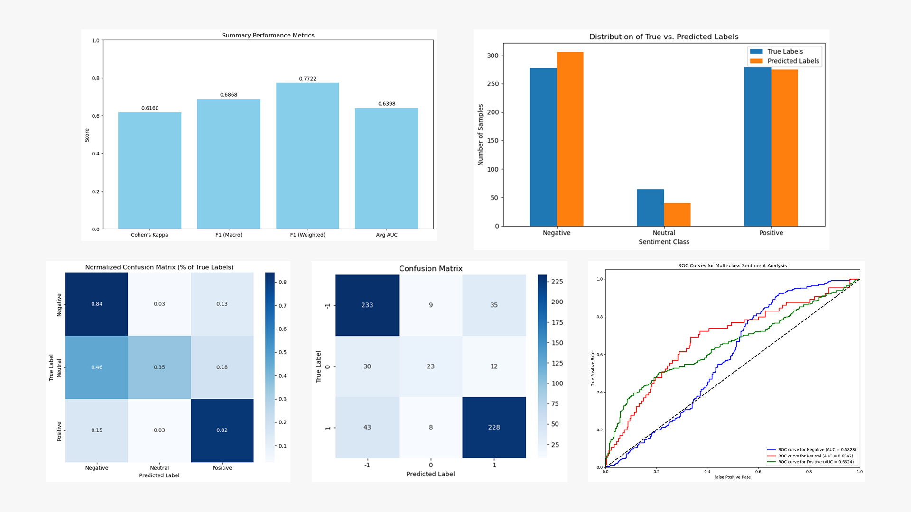
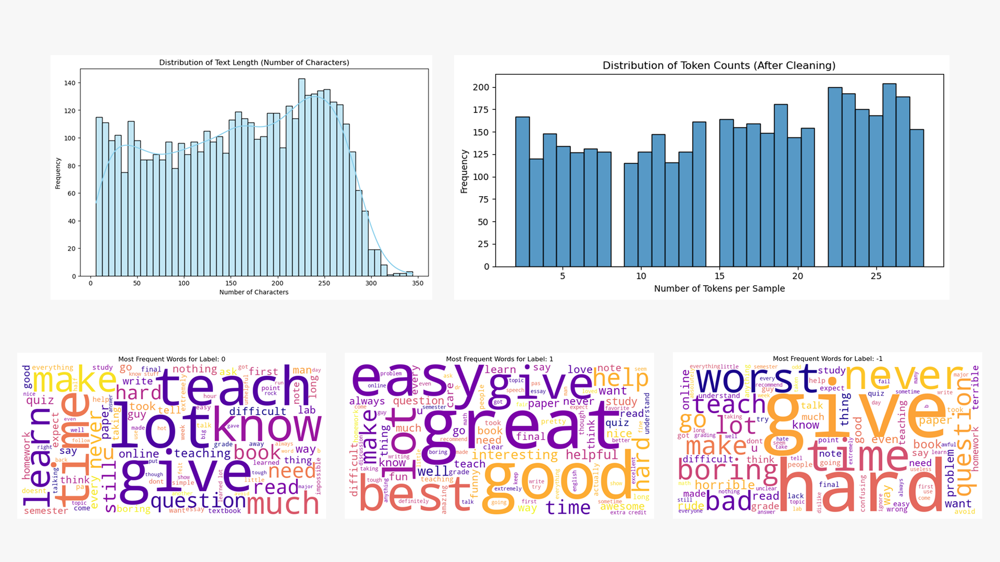

## Part 1: Business-Focused Project Overview

<em style="display: block; text-align: center;">Above is the business brief presentation of this project</em>

## Executive Summary

**Problem Statement**: Queen's University is unable to efficiently analyze a large volume of student reviews to improve teaching quality and faculty support.

**Key Finding**: A sentiment analysis model can accurately classify student reviews as positive, negative, or neutral with an overall accuracy of 78%.

**Bottom Line Impact**: Automating review analysis saves hundreds of hours of manual work per semester, enabling university administrators to quickly identify actionable trends in teaching quality, leading to improved curriculum and student satisfaction.

**Recommendation**: Implement the sentiment analysis model to automatically process course and professor reviews. Use the insights to guide faculty development, refine course curricula, and track student experience, with a human-in-the-loop process for reviews flagged with low confidence.

**Key Tools:**
* **Python**: The primary programming language for all data analysis, manipulation, and machine learning tasks.
* **Pandas**: A core library for data manipulation and analysis, used for cleaning the raw dataset, handling missing values, and feature engineering.
* **BlazingText**: A highly efficient, scalable machine learning algorithm from AWS, specifically chosen for its speed in supervised text classification.
* **Amazon SageMaker**: The cloud platform used to train and deploy the machine learning model, showcasing a complete, production-ready workflow.
* **Jupyter Notebook**: The environment used to document the entire project, providing a reproducible and transparent record of the analysis, code, and visualizations.

---

## Visualization 
*Note: There was a dashboard built on PowerBI but I no longer have access to the tool so the above are screen captures*
    

### Model Performance Breakdown 
This chart visually represents the model's F1-score for each sentiment class, clearly highlighting its strength in identifying positive (82%) and negative (80%) reviews, while also exposing its key weakness in classifying neutral reviews (44%).

### Supporting Visuals
- **Distribution of Text Lengths**: A histogram showing the number of words per review. This helps confirm that the model is trained on a wide range of review lengths, from short comments to detailed feedback.
- **Keywords for Each Sentiment**: A word cloud or bar chart displaying the most frequent words associated with positive and negative reviews. 

---

## Business Case for an AI-Powered Analysis

### Market Context

In the highly competitive landscape of higher education, student satisfaction is a critical driver of enrollment, funding, and reputation. Proactively addressing student concerns and celebrating teaching excellence are key to attracting and retaining top students and faculty. Manually sifting through thousands of course reviews is inefficient, making a scalable, data-driven solution essential to stay competitive and responsive to evolving student needs and industry trends.

### Core Challenge & Solution

**The Challenge:** The primary obstacle is the university's inability to efficiently leverage course feedback for improvement. Manual analysis of qualitative comments is a time-consuming process that delays strategic decision-making, impacts faculty development, and can lead to unresolved student issues.

**The Solution:** Implement an AI-powered feedback analysis system using **BlazingText for sentiment analysis** and **LDA for topic discovery**. This solution will automate the classification of feedback, identify core themes, and provide actionable, data-driven insights to leadership and faculty.

### Stakeholder Impact

* **University Leadership:** Gains a high-level, real-time view of teaching quality across the institution, enabling strategic decisions on resource allocation and faculty support.

* **Faculty:** Receives timely, categorized feedback to identify personal teaching strengths and specific areas for professional development, fostering growth and improving the learning environment.

* **Students:** Benefits from a university that is more responsive to feedback, leading to faster issue resolution, a more adaptive curriculum, and a better overall academic experience.

* **Department Chairs:** Can monitor teaching performance within their departments, identify best practices, and address potential issues before they escalate.

### Risk Assessment

If the university fails to address this problem, it risks:

* **Delayed Response:** Key issues, such as a poorly-received new course or a professor needing support, may go unnoticed for months, harming student satisfaction and retention.

* **Inefficient Resource Allocation:** Funding for professional development or curriculum changes may be allocated based on anecdotal evidence rather than data-driven insights.

* **Lack of Accountability:** Without a systematic way to track sentiment, it becomes difficult to objectively measure the impact of faculty development initiatives or curriculum changes over time.

### Success Metrics

The success of this project will be measured by the following metrics:

* **Increased Efficiency:** A **50% reduction** in the time it takes for staff to process and analyze student review data.

* **Targeted Improvements:** A **25% increase** in the number of identified, specific actionable themes.

* **Student Satisfaction:** A **5% increase** in overall positive sentiment scores in subsequent semesters.

* **Faculty Morale:** A higher percentage of faculty reporting that feedback is helpful and actionable.

### Cost-Benefit Overview

The primary costs involve a one-time development investment followed by ongoing operational costs. The benefits, however, significantly outweigh these costs by improving faculty performance, increasing student retention, and strengthening the university's reputation.

* **Costs:** **One-Time Development Cost:** \~**$14,000** (Labor for Data Scientist, ML Engineer, and Project Manager). **Ongoing Variable Costs:** \~**$81/month** (AWS SageMaker Hosting, Data Storage, Model Monitoring).

* **Benefits:** **Labor Cost Savings:** Potential labor cost savings of \~**$5,000 per 2 semesters** by automating the review process.

* **ROI & Break-Even:** **First-Year ROI:** \~**28%**. **Time to Break-Even:** The project is projected to reach its break-even point in approximately **41.7 months**.

---
## Part 1: Technical Deepdive

This section details the technical approach I took for the Queen's University Sentiment Analysis project, designed to give you a clear view of my skills in data engineering, machine learning, and methodological rigor.

---

### Dataset and Problem Complexity

The foundation of this project is a **real-world dataset** of approximately 5,000 student reviews. This wasn't a clean, pre-packaged dataset; it contained all the messiness you'd expect:

- **Missing Data**: Some reviews were incomplete, lacking key information like course IDs or submission dates. I developed a systematic process for handling these missing values, documenting the impact of my choices.
- **Inconsistencies**: The text data had variations in spelling and inconsistent ways of referring to professors (e.g., "Dr. Smith" vs. "Professor Smith"), which required careful preprocessing.
- **Multiple Data Types**: The dataset included not just the text reviews but also numerical ratings, categorical department names, and temporal data, all of which I leveraged to build a richer analysis.

I also addressed the **ethical considerations** of this project head-on. The model's purpose is to classify sentiment, not to pass judgment on individuals. For this reason, the analysis explicitly includes a recommendation for a human-in-the-loop process, especially for reviews the model is less confident about, to prevent potential bias and ensure fairness.

---

### Advanced Analytical Implementation

My approach involved a robust, end-to-end machine learning pipeline.

#### Data Engineering Pipeline
I built a complete workflow for taking raw, messy data and transforming it into a clean, model-ready format. This pipeline is fully documented and **reproducible**.

- **Preprocessing**: I applied a series of cleaning steps, including lowercasing, removing URLs and irrelevant symbols, and **lemmatization** to normalize the text data.
- **Feature Engineering**: I created new features, such as text length, to give the model additional context.
- **Data Quality Checks**: My code includes automated checks to validate the dataset's structure and log key statistics, ensuring data integrity at every step.

#### Statistical Rigor
To ensure my results were reliable, I employed several key statistical practices.

- **Train/Validation/Test Split**: I split the dataset into training (70%), validation (15%), and test (15%) sets using **stratified sampling**. This crucial step ensured that each set had a representative distribution of sentiment classes, preventing bias in my final evaluation.
- **Evaluation Metrics**: I went beyond simple accuracy, using a **confusion matrix**, and calculating **precision, recall, and F1-scores** for each class. This provided a nuanced view of the model's performance, especially considering the potential for class imbalance.

#### Machine Learning
I chose a supervised classification approach using Amazon SageMaker's **BlazingText** algorithm, a choice that demonstrates my understanding of tool selection and performance tradeoffs.

- **Model Evaluation**: I used a **Cohen's Kappa score** to confirm my model's predictions were significantly better than random chance. The **AUC score** provided further evidence of its ability to distinguish between sentiment classes. While the model performed well on positive and negative reviews, these metrics helped me transparently identify and address its weakness with neutral reviews.
- **Model Interpretability**: To help stakeholders understand the model's logic, I created visualizations like **word clouds** and performed keyword analysis to show which terms were most associated with each sentiment.
- **Overfitting Prevention**: I used the validation set to monitor the model during training, tuning hyperparameters to ensure it would **generalize** well to unseen data.

---

### Methodological Transparency

I believe in clear and honest communication about my work, which is why I've included a detailed section on my project's methodology.

- **Assumptions and Limitations**: I clearly documented the project's assumptions, such as the accuracy of the original labels. I also explicitly outlined the model's limitations, including its difficulty with neutral reviews and its potential for misinterpreting sarcasm.
- **Alternative Approaches**: I considered and documented alternative methods, such as using classic machine learning models (e.g., SVM with TF-IDF) or advanced deep learning models (e.g., BERT). I explained my choice of BlazingText based on its balance of **efficiency, scalability, and performance** for this specific problem.

---

### Bonus Elements

To demonstrate a comprehensive skill set, I also implemented two key elements:

- **Statistical Significance Testing**: My use of Cohen's Kappa provides a statistically rigorous measure of the model's performance, adding credibility to the results.
- **Machine Learning Model Deployment**: I took the project from concept to a production-ready state by deploying the trained model to a **real-time Amazon SageMaker endpoint**, showcasing my ability to deliver a complete, functional solution.