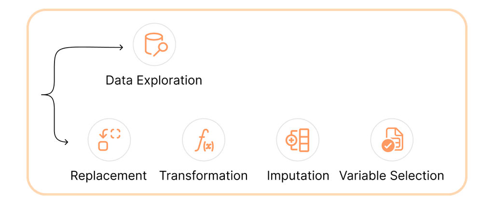
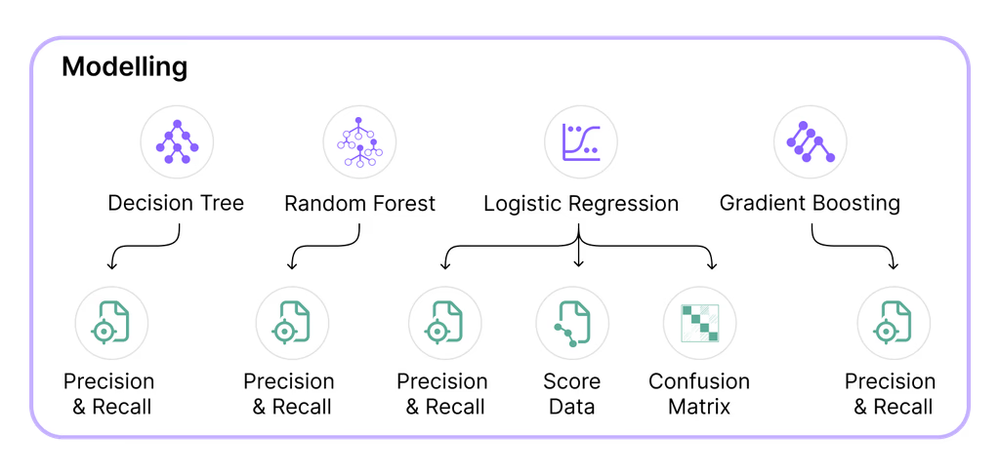
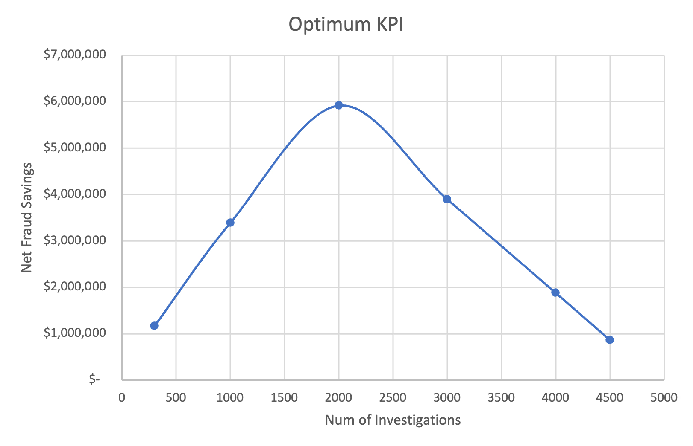
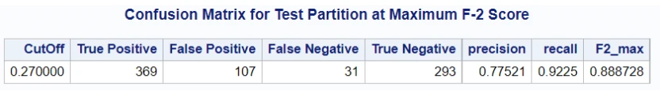

## Goal
An auto insurance company struggles with insurance fraud claims, currently experiencing a fraud rate 3% above the industry norm. This project aims to develop a proof-of-concept ML model to decrease fraud. "Net Fraud Savings" will measure success ML model success, indicating the financial impact of fraud prevention.

---

## Steps for Analysis

### 1. Data Preparation
We conducted **exploratory data analysis (EDA)** to gain a better understanding and prepare the data for supervised machine learning. The entire dataset contained 25 attributes, of which 9 were numerical and, 16 were categorical.

Key steps included:
-   Eliminated irrelevant variables and managed missing data through specific imputation strategies.
-   Addressed outliers by replacing them with mean values or set thresholds tailored to maintain the practical business case.
-   Conducted a thorough analysis of variable correlations and distributions to inform the data-cleaning process.

### 2. ML Predictive Modelling
We divided the dataset, which contained 20,000 cases, into 10 subsets (10-fold cross-validation) to achieve accurate ML predictions. This division helped the ML model maintain a balance between the data's variance and a biased model, addressing the bias-variance trade-off.

Four models were tested:
-   Logistic Regression
-   Decision Trees
-   Gradient Boosting
-   Random Forests

**Random Forest** was identified as the best model for detecting fraudulent claims, as it made the fewest mistakes. The most significant factors indicating fraud were **estimated payout**, **past number of claims**, and **vehicle prices**.

---
## ML Metrics
-   **F2 Score:** The F2 score emphasizes Recall over Precision, focusing on reducing False Negatives. This approach prioritizes the investigation of the most suspicious claims to help decrease the number of fraudulent claims that get paid out without many errors.
-   **Lift Metric:** The lift metric supports trust in the AI model as it shows the effectiveness of the predictive model when comparing it to a random sample of data. 

---

## Results

-   **Potential net fraud savings:** ~$5.9 million per year with 2,000 investigations.
-   **Effective detection:** The model is 70% more effective at detecting fraud than random sampling (4x random detection).
-   **Processing time:** Real-time processing at 0.07 seconds per claim.

The **Random Forest** model was the top performer, with an **F-2 score of 0.948213**. It achieved a **lift score of 1.70**, indicating it is 70% more effective than random sampling. The project suggests that performing 2,000 investigations could lead to annual savings of approximately **$5.9 million**.

---
## Citation
shameladdas. (2022). Comm 392 Auto Claims Fraud Competition (Fall 2022). Kaggle. [https://kaggle.com/competitions/test-comm-392-auto-claims-fraud-competition-f2022](https://kaggle.com/competitions/test-comm-392-auto-claims-fraud-competition-f2022)

[Kaggle Data Set](https://kaggle.com/competitions/test-comm-392-auto-claims-fraud-competition-f2022)