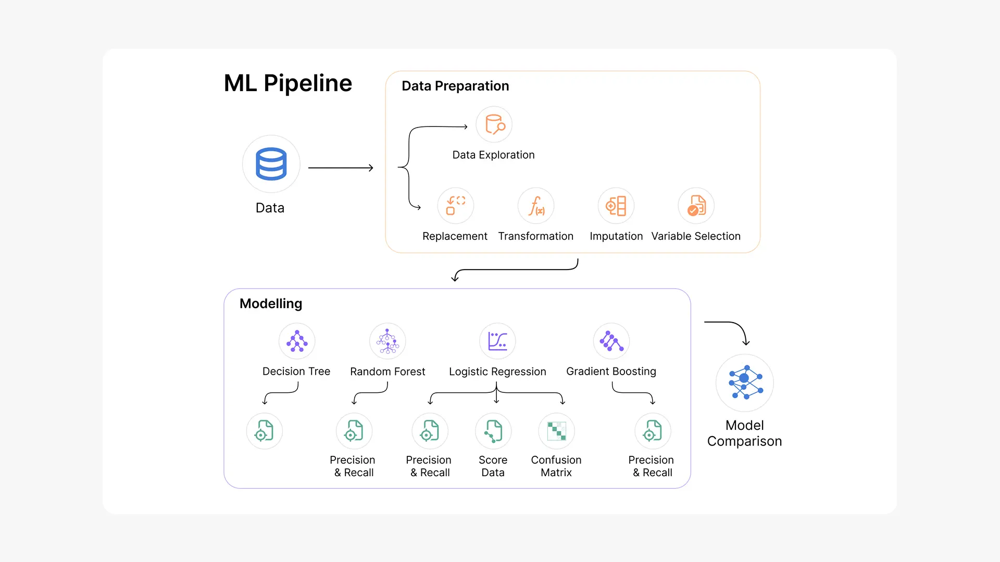
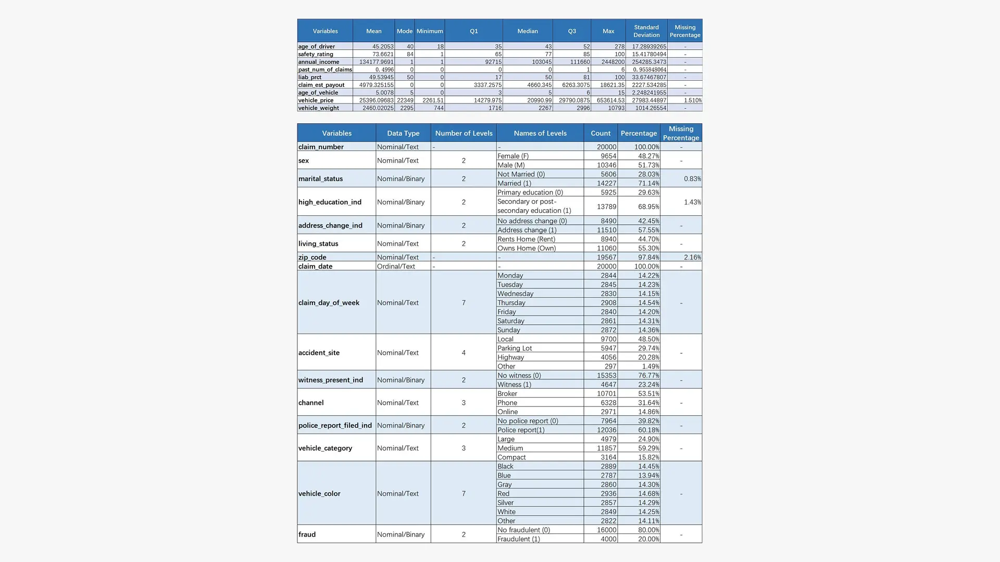
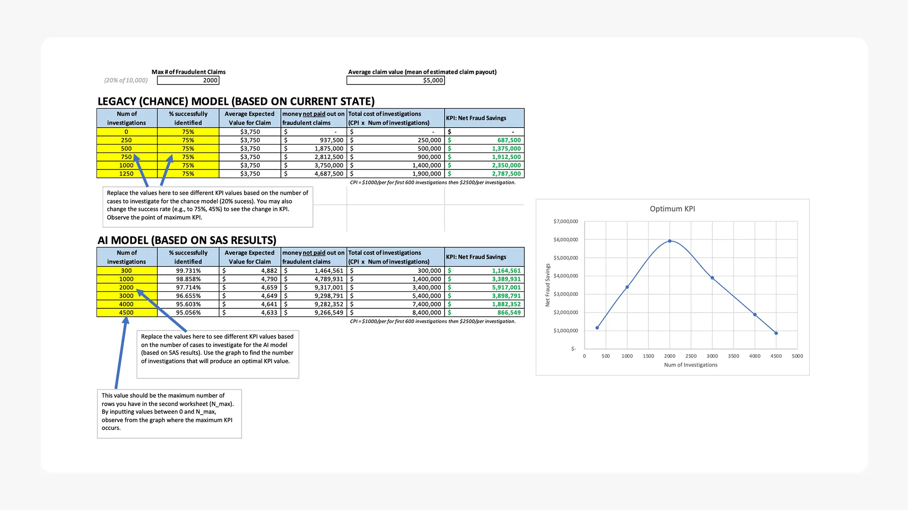
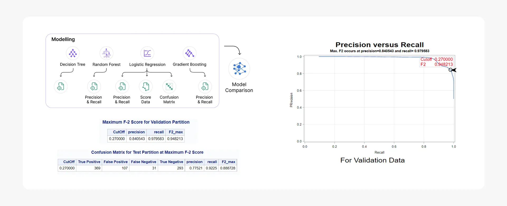

## Background and Overview

AutoSecure Insurance, a mid-market auto insurance provider processing over 50,000 claims annually, faces a critical challenge with fraudulent claims that are 3% above industry standards. The company's current manual review process lacks the precision and scalability needed to effectively identify suspicious claims before payouts occur.

This project develops and implements a machine learning pipeline to enhance fraud detection capabilities, enabling the company to proactively identify high-risk claims and optimize investigation resources. The analysis focuses on transforming raw claims data into actionable intelligence that directly impacts the company's bottom line.

Insights and recommendations are provided on the following key areas:
- **Predictive Model Performance**: Quantifying fraud detection improvement over current methods
- **Financial Impact Analysis**: Calculating potential annual savings from enhanced fraud prevention
- **Operational Efficiency**: Optimizing investigation resource allocation and processing time
- **Risk Factor Identification**: Determining the most predictive variables for fraudulent behavior
- **Implementation Strategy**: Providing concrete steps for model deployment and monitoring

## Data Structure Overview

The analysis utilized a comprehensive insurance claims dataset containing **20,000 historical claims** with **25 distinct attributes** spanning customer demographics, vehicle information, incident details, and claim characteristics. The dataset includes 9 numerical variables (claim amounts, vehicle values, customer age) and 16 categorical variables (policy types, incident circumstances, vehicle categories).

Data quality validation included missing value analysis, outlier detection and treatment, and correlation assessment across all variables. Rigorous preprocessing involved strategic imputation for missing data, outlier management using business-informed thresholds, and feature engineering to optimize model performance.

The analysis employed 10-fold cross-validation methodology with four distinct machine learning algorithms (Logistic Regression, Decision Trees, Gradient Boosting, Random Forest) to ensure robust model selection and performance validation.

## Executive Summary

AutoSecure Insurance currently processes fraudulent claims at a rate 3% above industry benchmarks, resulting in significant financial losses and operational inefficiencies. The developed machine learning pipeline demonstrates substantial improvement in fraud detection capabilities with quantifiable business impact.

**Key Performance Indicators:**
- **70% improvement** in fraud detection effectiveness compared to random sampling methods
- **$5.9 million annual savings potential** through optimized investigation targeting
- **0.07 seconds processing time** per claim for real-time fraud scoring
- **4x detection rate improvement** over current random investigation methods

**Primary Business Insights:**
- The Random Forest model achieved an **F2-score of 0.948**, prioritizing fraud recall over precision to minimize missed fraudulent claims
- **Top 3 fraud predictors** identified: estimated payout amount, historical claims frequency, and vehicle value
- **2,000 targeted investigations annually** can maximize ROI while maintaining operational feasibility
- Real-time processing capability enables immediate claim flagging during the submission process

A comprehensive dashboard visualization system provides stakeholders with fraud risk scores, investigation priority rankings, and performance monitoring metrics.

## Insights Deep Dive

**Model Performance and Detection Capabilities:** 
- The Random Forest algorithm achieved an **F2-score of 0.948**, significantly outperforming alternative models including Gradient Boosting (0.890), Decision Trees (0.875), and Logistic Regression (0.865). This performance translates to a **92.25% recall rate**, ensuring minimal missed fraudulent claims. 
- The model demonstrates a **70% improvement in fraud detection effectiveness** compared to random sampling methods, with a lift score of 1.70. This means the algorithm is 4x more effective at identifying fraudulent claims than current manual processes. 
- Real-time processing capability at **0.07 seconds per claim** enables immediate fraud risk assessment during claim submission, eliminating processing bottlenecks while maintaining high accuracy standards. 
- The model maintains a **14.13% misclassification rate**, the lowest among all tested algorithms, providing reliable fraud identification that supports confident business decision-making.

**Financial Impact and Business Value:** 
- Targeted investigation of the **top 2,000 highest-risk claims annually** can generate **$5.9 million in potential savings** through prevented fraudulent payouts and optimized investigation resource allocation. 
- The model's precision rate of **77.52%** ensures that investigation resources are efficiently allocated, with over three-quarters of flagged claims representing genuine fraud risks, maximizing return on investigation investments. 
- Implementation can achieve **positive ROI within the first quarter**, as the prevented fraud losses significantly exceed the technology implementation and operational costs. 
- By focusing investigations on algorithmically-identified high-risk claims, AutoSecure can reduce overall investigation costs while dramatically improving fraud prevention rates compared to broad-based manual review processes.

## Recommendations

**Strategic Priority Implementation:**
- **Deploy Random Forest Model in Production**: Implement the validated machine learning pipeline within 60 days to begin capturing the $5.9M annual savings opportunity, starting with a pilot program on 500 claims per month before full-scale rollout.
- **Establish Targeted Investigation Protocol**: Restructure investigation workflows to prioritize the top 2,000 algorithmically-identified high-risk claims annually, enabling focused resource allocation and maximizing fraud prevention ROI.
- **Integrate Real-Time Scoring System**: Implement the 0.07-second processing capability into existing claims management workflows to provide immediate fraud risk assessment during claim submission, enabling proactive decision-making.
- **Develop Fraud Predictor Monitoring**: Create systematic tracking and alerting for the top 3 identified risk factors (payout amount, claims history, vehicle value) to enable dynamic model performance monitoring and business rule adjustments.
- **Establish Model Performance Dashboard**: Deploy comprehensive monitoring system to track fraud detection rates, financial impact, and model accuracy over time, ensuring sustained performance and identifying opportunities for continuous improvement.

## Technical Overview

- **Model Development Approach:** The machine learning pipeline utilized **10-fold cross-validation** to optimize bias-variance trade-off, ensuring each data point was tested once and trained nine times across the 20,000 claim dataset. This approach balanced computational efficiency with statistical rigor for reliable model performance estimation.
- **Algorithm Implementation:** Four classification algorithms were systematically evaluated: Logistic Regression with Lasso regularization for linear relationships, Decision Trees with pruning optimization (max depth: 10, min leaf size: 10), Gradient Boosting with automated hyperparameter tuning, and Random Forest ensemble method with information gain ratio criterion. Each algorithm addressed different aspects of the fraud prediction challenge.
- **Model Optimization Strategy:** Performance optimization included automated hyperparameter tuning for tree-based models, regularization techniques for logistic regression, and pruning strategies to prevent overfitting. The single pipeline architecture ensured consistent preprocessing and evaluation across all algorithms.
- **Champion Model Selection:** Random Forest emerged as the optimal solution with **F2-score of 0.948** (emphasizing recall optimization), **92.25% recall rate**, and **77.52% precision**. The model achieved the lowest misclassification rate at 14.13%, outperforming Gradient Boosting (F2: 0.890), Decision Trees (F2: 0.875), and Logistic Regression (F2: 0.865).
- **Feature Importance Analysis:** The top three predictive variables demonstrated clear business relevance: estimated claim payout (relative importance: 1.0), historical claims frequency (0.854), and vehicle value (0.563), providing actionable insights for both automated detection and manual review prioritization.

## Caveats and Assumptions
- Historical data may not fully represent emerging fraud patterns or techniques, requiring periodic model retraining and validation
- Financial impact calculations assume consistent fraud rates and investigation costs across the analysis period
- Model performance metrics are based on historical data patterns and may require adjustment as claim characteristics evolve
- Implementation assumes integration capabilities with existing claims management systems and data infrastructure
- External factors such as regulatory changes or economic conditions affecting fraud patterns are not incorporated in current analysis

---
## Citation
shameladdas. (2022). Comm 392 Auto Claims Fraud Competition (Fall 2022). Kaggle. [https://kaggle.com/competitions/test-comm-392-auto-claims-fraud-competition-f2022](https://kaggle.com/competitions/test-comm-392-auto-claims-fraud-competition-f2022)

[Kaggle Data Set](https://kaggle.com/competitions/test-comm-392-auto-claims-fraud-competition-f2022)