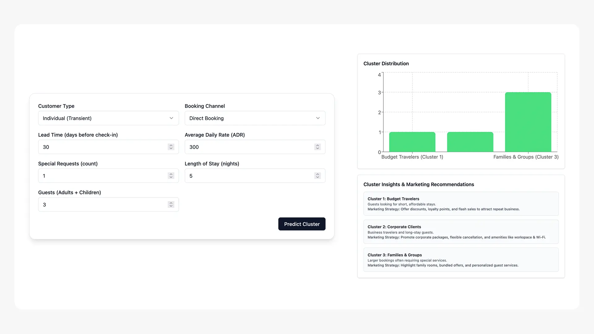
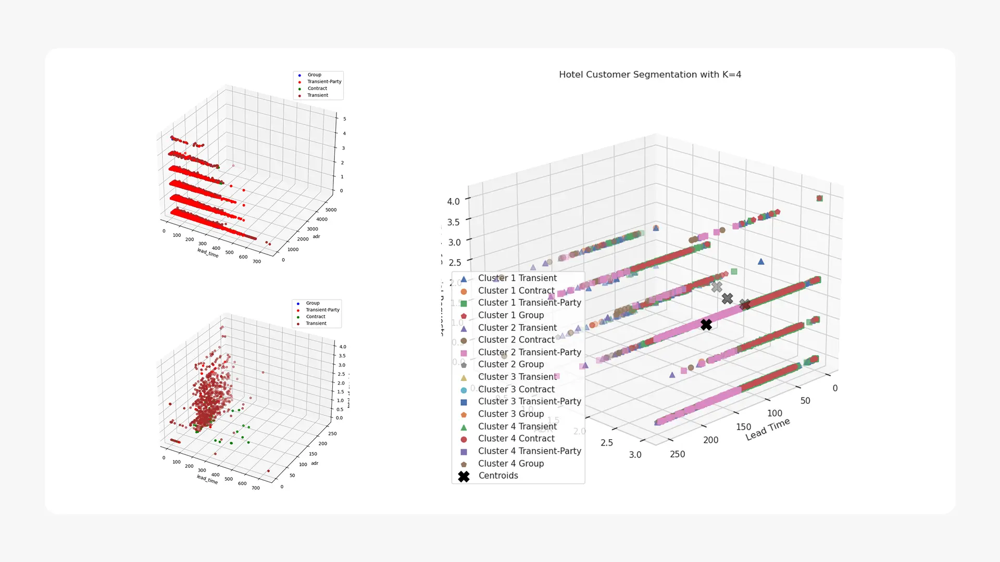
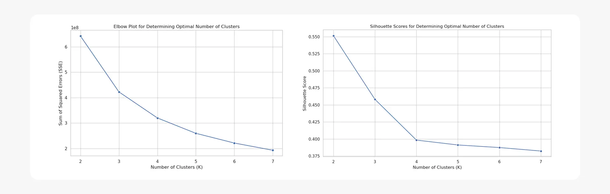

## Part 1: Business-Focused Project Overview

<em style="display: block; text-align: center;">Above is the business brief presentation of this project</em>

### 1\. Background and Overview

"HOTEL" is a hospitality company that faces a core challenge in understanding its guests. The company relies on traditional, non-data-driven methods for customer segmentation, which leads to ineffective marketing and missed revenue opportunities. This project leverages **K-Means clustering** to transform this approach by analyzing guest booking behaviors to create distinct, data-driven segments.

The primary goal is to provide a more targeted marketing and service strategy, ultimately boosting key business metrics. This analysis will specifically focus on the following key areas:

  * **Guest Segmentation**: Grouping guests into meaningful segments based on attributes like average daily rate (ADR), lead time, length of stay, and number of special requests.
  * **Marketing ROI**: Improving the effectiveness of promotional campaigns by targeting the right guest segments with personalized offers.
  * **Occupancy and Revenue**: Increasing off-peak occupancy and package purchases through tailored strategies.
  * **Operational Efficiency**: Automating the guest segmentation process to streamline hotel operations and provide continuous insights.

-----

### 2\. Data Structure Overview

This project utilizes the `hotel_bookings_2.csv` dataset, which contains **119,390 rows** and **32 columns** of hotel booking information. The data includes a mix of numerical and categorical features. Key numerical data includes `lead_time`, `adr` (average daily rate), and `stays_in_weekend_nights`. Categorical data includes `hotel` type, `country`, `market_segment`, and `distribution_channel`.

A thorough data quality check was performed to ensure data integrity. This involved addressing several issues, including the presence of outliers in the `adr` column and missing values in the `company`, `agent`, `country`, and `children` columns. The outliers in `adr` were removed, and rows with null values were dropped to maintain data integrity. The remaining data was then cleaned, prepared, and one-hot encoded for use in the K-Means clustering model. The final processed data was converted to a NumPy array for use with **SageMaker's** built-in K-Means algorithm.

| Data Type           | Number of Columns | Example Columns                                                                |
| ------------------- | ----------------- | ------------------------------------------------------------------------------ |
| **Integer (int64)** | 16                | `is_canceled`, `lead_time`, `adults`, `babies`, `total_of_special_requests`    |
| **Object (Text)**   | 12                | `hotel`, `country`, `reserved_room_type`, `deposit_type`, `reservation_status` |
| **Float (float64)** | 4                 | `children`, `adr`, `agent`, `company`                                          |

|Column Name|Number of Missing Values|
|---|---|
|**`company`**|112,593|
|**`agent`**|16,340|
|**`country`**|488|
|**`children`**|4|

-----

### 3\. Executive Summary

Traditional, non-data-driven guest segmentation has led to missed opportunities for the "HOTEL" company, resulting in stagnation in key business metrics. By leveraging a **K-Means clustering model**, we can move from a manual to a data-driven approach, creating distinct guest segments based on booking behaviors.

The projected financial outcomes of this solution are highly favorable:

  * A **293% ROI** in Year 1 is projected, with a quick **3.1-month payback period**.
  * Annual returns are estimated at **$124,800**, primarily from a **20% increase in off-peak occupancy**, a **15% boost in personalized package purchases**, and a **15% reduction in marketing costs**.
  * The total project cost is estimated at **$32,500**.
  * This approach will also improve marketing ROI by **30%** and increase customer retention by **10%**.

This project's findings and actionable recommendations are provided in the following sections.

-----
### 4. Insights Deep Dive

**Model Performance and Segmentation Capability:**
- The **K-Means clustering model** successfully segmented hotel guests based on attributes such as lead time, average daily rate (ADR), length of stay, and number of special requests. This unsupervised learning approach found natural groupings in the data without requiring pre-labeled training sets.
- The optimal number of clusters (`k`) was determined using both the **Elbow Method** and the **Silhouette Method**, ensuring the segmentation provides a good balance between the number of groups and the variance within them
- By using **SageMaker's HyperparameterTuner**, the model was systematically optimized, leveraging an objective metric of `test:msd` (mean squared distance) to find the best configuration for parameters like `extra_center_factor` and `mini_batch_size`. This process guarantees a robust and reliable model.
- The final model, deployed as a **SageMaker endpoint**, is capable of real-time predictions, accepting new customer data and returning a cluster assignment. This real-time capability allows for immediate and personalized service recommendations and marketing.

**Business Impact and Financial Projections:**
- The project is a high-value investment with a projected **293% ROI in Year 1** and a short **3.1-month payback period**, based on a **$32,500** total cost and a projected annual return of **$124,800**.
- Targeted promotions informed by the segmentation model are expected to increase off-peak occupancy by **20%**, leading to **$96,000** in additional annual revenue. This demonstrates a clear path to increasing revenue by addressing a key business challenge.
- The model will boost personalized package purchases by **15%**, contributing **$18,000** annually. This proves that data-driven insights can directly influence customer purchasing behavior and drive higher average transaction values.
- Operational efficiency gains from the automation of guest segmentation will provide continuous monitoring and long-term optimization, streamlining hotel operations and providing a competitive advantage.

-----

### 5\. Recommendations

Based on the analysis and model development, the following strategic recommendations are proposed:

  * **Implement the Automated Segmentation System**: Fully deploy the K-Means clustering model as a proof-of-concept system for real-time guest segmentation. This will allow the hotel to move beyond its traditional approach and leverage a data-driven strategy for customer understanding and marketing.
  * **Develop a User-Friendly Dashboard**: Create an interactive dashboard that visualizes the characteristics of each guest segment. This will provide university leadership, faculty, and department chairs with actionable insights, enabling them to make informed decisions and create personalized strategies for each group.
  * **Launch Segment-Specific Marketing Campaigns**: Use the insights from the newly defined segments to create targeted promotions. For example, segments identified as "off-peak bookers" could be targeted with specific incentives to increase occupancy during low-demand periods, while other segments could be offered personalized packages to boost purchases.
  * **Integrate the System with Existing Operations**: Integrate the customer segmentation system with existing hotel systems to streamline operations and enhance guest services. This will enable a more efficient and personalized guest experience, ultimately improving overall customer satisfaction.
  * **Ensure Continuous Monitoring and Refinement**: Establish a process for continuous monitoring of the model's performance and a plan for periodic retraining. This will ensure the model remains effective and accurate over time, accounting for changes in guest behavior and market trends.

### Technical Overview

- **Model Development:** SageMaker's built-in **K-Means algorithm** was used for guest segmentation. Multiple models were trained with `k` values from **2 to 7**.
- **Data Preprocessing:** The dataset was cleaned by removing **outliers from the `adr` column** (values above the 99th percentile) and **null values** from the `number_of_adults_and_children` column. Categorical features like `customer_type` and `distribution_channel` were **one-hot encoded** into numerical values for the algorithm. The preprocessed data was formatted as a NumPy array of type 'float32' for SageMaker.
- **Model Optimization:** The optimal number of clusters (`k`) was determined using both the **Elbow Method** and the **Silhouette Method** to balance the number of clusters with model variance and data point fit. Hyperparameter tuning was performed using **SageMaker's HyperparameterTuner**, which minimized the `test:msd` (mean squared distance) metric.
- **Model Deployment:** The best-performing model was deployed to a **SageMaker endpoint** to enable real-time predictions for new customer data. A simple program was created to demonstrate how the deployed model could classify new customers by returning a cluster assignment and the distance to the centroid.

### Caveats and Assumptions

  * **Data Limitation**: The analysis is based on the provided `hotel_bookings_2.csv` dataset, and its findings are limited by the scope and quality of this data. While cleaning steps were taken, any unaddressed biases or limitations in the original data may impact the conclusions.
  * **Business Context**: The financial projections assume a **10-room property with a baseline occupancy rate of 50%**. These numbers serve as a proof-of-concept and may need to be adjusted based on the specific hotel's size and current performance metrics.
  * **External Factors**: The analysis does not account for unforeseen external factors, such as economic downturns, changes in travel trends, or other market disruptions, which could impact hotel occupancy and revenue.
  * **Feature Availability**: The effectiveness of the model relies on the availability and accuracy of the specified features (`lead time`, `adr`, `length of stay`, etc.) in real-time hotel systems.