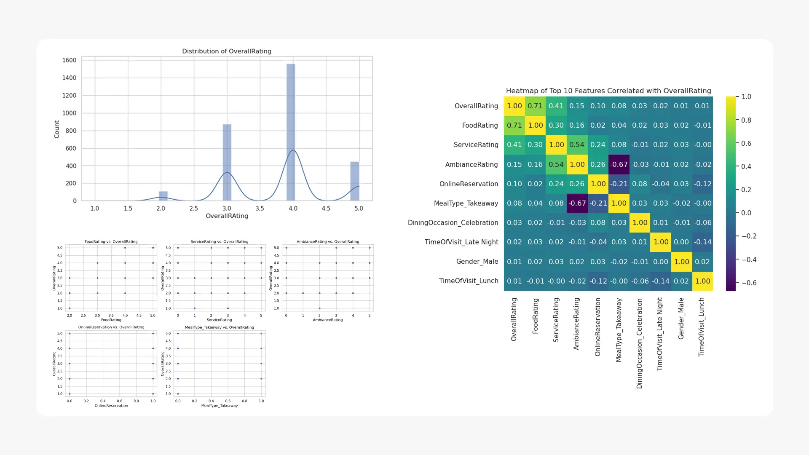
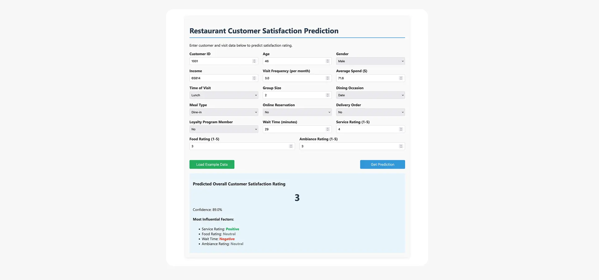
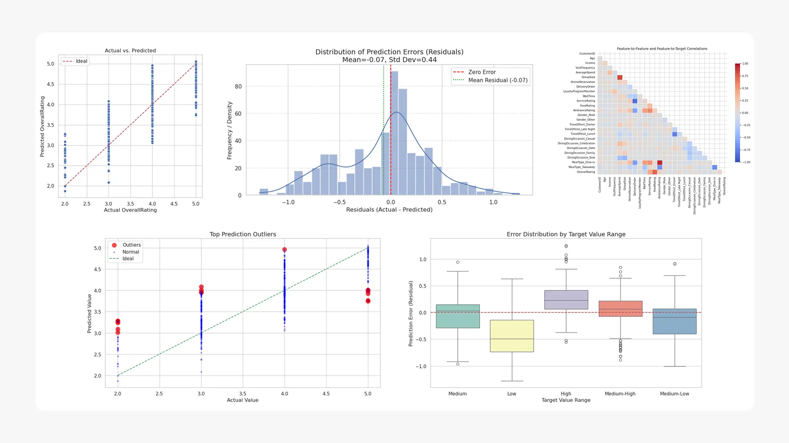

## Part 1: Business-Focused Project Overview

<em style="display: block; text-align: center;">Above is the business brief presentation of this project</em>

## Background and Overview

Wooden Heads, a restaurant in downtown Kingston, operates in a highly competitive market where customer expectations are rising and online reviews significantly influence reputation.

The company faced the challenge of understanding what drives customer satisfaction scores across different dining experiences. This project analyzes customer data to uncover the specific factors that influence satisfaction, enabling the business to make data-driven decisions and improve service.

The project's scope included analyzing customer data to identify key drivers of satisfaction, simulating "what-if" scenarios, and developing actionable recommendations to improve the customer experience and business performance.

Insights and recommendations are provided on the following key areas:
* **Customer Satisfaction Prediction:** Understanding how factors like wait time, service quality, and spending predict overall customer satisfaction.
* **Business Impact and ROI:** Quantifying the potential return on investment, including projected increases in repeat visits and average check size.
* **Operational Improvement:** Identifying areas where targeted improvements would have the greatest impact on customer satisfaction and business metrics.
* **Data-Driven Decision Making:** Providing management with a tool for informed decision-making and efficient resource allocation.

***

## Data Structure Overview

| Column Name | Data Type | Description |
|:---|:---|:---|
| `CustomerID` | `int64` | A unique identifier for each customer. |
| `Age` | `int64` | The age of the customer. |
| `Gender` | `object` | The gender of the customer (`Male`, `Female`, `Other`). |
| `Income` | `int64` | The annual income of the customer. |
| `VisitFrequency` | `float64` | The frequency of restaurant visits. |
| `AverageSpend` | `float64` | The average amount spent by the customer per visit. |
| `TimeOfVisit` | `object` | The time of day of the visit (`Lunch`, `Dinner`, `Brunch`). |
| `GroupSize` | `int64` | The number of people in the dining group. |
| `DiningOccasion` | `object` | The purpose of the dining occasion (`Date`, `Family`, `Business`, `Casual`, `Solo`). |
| `MealType` | `object` | The type of meal service (`Dine-in`, `Takeaway`, `Delivery`). |
| `OnlineReservation` | `int64` | Indicates if an online reservation was made (`1` for yes, `0` for no). |
| `DeliveryOrder` | `int64` | Indicates if the order was for delivery (`1` for yes, `0` for no). |
| `LoyaltyProgramMember`| `int64` | Indicates if the customer is a loyalty program member (`1` for yes, `0` for no). |
| `WaitTime` | `int64` | The wait time in minutes for a table. |
| `OverallRating` | `int64` | The customer's overall rating of the experience. |
| `ServiceRating` | `int64` | The customer's rating of the service. |
| `FoodRating` | `int64` | The customer's rating of the food. |
| `AmbianceRating` | `int64` | The customer's rating of the restaurant ambiance. |

The project utilized a dataset of 3,000 restaurant review instances, containing 26 features. These features describe various aspects of the dining experience, such as `CustomerID`, `Age`, `Income`, `VisitFrequency`, `AverageSpend`, `WaitTime`, `ServiceRating`, `FoodRating`, and `AmbianceRating`, with `OverallRating` as the target variable.

Data quality checks were performed through a comprehensive pipeline that included loading, cleaning, and preprocessing raw data. This process involved handling missing values and converting categorical data into numerical representations using techniques like one-hot encoding. The dataset was then split into training and validation sets at an 80/20 ratio for model development. The primary tools used for this process were Python, along with libraries such as pandas and NumPy.

***

## Executive Summary

The analysis revealed that customer satisfaction at Wooden Heads can be accurately predicted by key factors, including wait time, service quality, and spending. This data-driven approach is projected to yield significant business improvements and a rapid return on investment.

Key performance indicators show a **projected 2% increase in repeat customer visits** and a **2% higher average check size**. Additionally, a **3% decrease in service recovery costs** is expected.

Primary insights from the analysis include:
* The project is expected to deliver a **100% first-year return on investment (ROI)**, with a break-even point in just 4-5 months.
* The initial fixed cost of the project was approximately **$9,000**, with ongoing variable costs of around **$130 per month** for AWS services.
* The projected annual revenue increase is estimated to be around **$20,000**, which is achieved through increased customer visits, a higher average check size, and reduced service recovery costs.
* The model allows the business to simulate "what-if" scenarios, enabling targeted improvements to maximize impact.

The project also included the creation of a visual dashboard to help stakeholders interpret key success drivers and predictions.

***

## Insights Deep Dive

**Business Impact and Financial Returns:**

- The project is expected to deliver a **100% first-year ROI**, with a break-even point in months 4-5.
- The total project cost was approximately **$9,000** for labor and an ongoing **$130 per month** for AWS services. These costs are offset by a projected annual revenue increase of **$20,000**.
- This financial impact is driven by a projected **2% increase in repeat customer visits**, a **2% increase in average check size**, and a **3% decrease in service recovery costs**.
- This data-driven solution provides a competitive advantage by enabling the business to proactively enhance the dining experience, which helps prevent a loss of market share.

**Operational Capabilities and Stakeholder Impact:**

- The solution provides management with a powerful tool for informed decision-making and efficient resource allocation, moving away from relying on anecdotal feedback.
- Customers will benefit from an enhanced dining experience and more personalized service.
- Employees, including servers and kitchen staff, would benefit from targeted training and incentives tied to satisfaction metrics, leading to improved service quality.
- The ability to predict customer satisfaction based on specific factors allows for proactive improvements rather than reactive service recovery, which is expected to decrease costs by **3%**.

***

## Recommendations

* **Implement a Reputation Management System**: Based on the finding that online reviews are crucial for reputation, the business should implement a system to continuously monitor and respond to customer feedback across various platforms. This will leverage the insights from the analysis to proactively manage the restaurant's online presence and address negative feedback before it escalates.
* **Launch a Needs-Driven Loyalty Program**: The analysis identified key drivers of customer satisfaction. The restaurant should use this data to create a personalized loyalty program that offers rewards based on customer behavior and preferences, encouraging repeat visits and higher spending. For example, customers who value low wait times could receive a "skip the line" benefit.
* **Establish Targeted Training Programs**: The project revealed the importance of service quality. The restaurant should use the model's insights to design targeted training modules for staff, focusing on areas identified as having the most significant impact on customer satisfaction. Tying these training programs to performance metrics could reinforce their effectiveness.

***

### Technical Deep Dive

- **Model Development Approach:** The project utilized an end-to-end machine learning pipeline to predict customer satisfaction. The data was processed to handle missing values and convert categorical features into numerical representations using one-hot encoding. The data was then split into a training set (80%) and a validation set (20%).
- **Algorithm Implementation:** The core of the analysis was a regression model using the **AWS SageMaker's Linear Learner algorithm**. This choice was made to specifically identify how each factor influences customer satisfaction scores.
- **Model Optimization Strategy:** Data preprocessing included Winsorization to manage outliers and Robust Scaling to make features more resistant to outlier effects. This ensured the model's robustness and accuracy.
- **Champion Model Selection:** The Linear Learner model was trained and evaluated using standard regression metrics, including Mean Squared Error (MSE), Mean Absolute Error (MAE), and R-squared ($R^2$). The model's performance was also visually represented in a dashboard to help stakeholders interpret the results.
- **Model Deployment:** A key technical component was the deployment of the trained model as an **AWS SageMaker endpoint**. This step allows for real-time predictions on new data, demonstrating an understanding of the complete machine learning lifecycle from development to deployment.

***

### Caveats and Assumptions

* **Data Limitations**: The model's performance is tied to the quality of the raw data. While preprocessing was performed, the model's predictions rely on the accuracy and completeness of the provided 3,000 review instances.
* **Model Assumptions**: The **Linear Learner algorithm** assumes a linear relationship between the input features and the target variable, which may not fully capture all the complexities of customer behavior.
* **Generalizability**: The analysis is based on data from a specific restaurant, and the findings may not be directly applicable to other locations or restaurant types without further validation.
* **External Factors**: The analysis does not account for external factors like macroeconomic trends, seasonal fluctuations, or new competitor entrants, all of which could impact the projected revenue increase and ROI.
